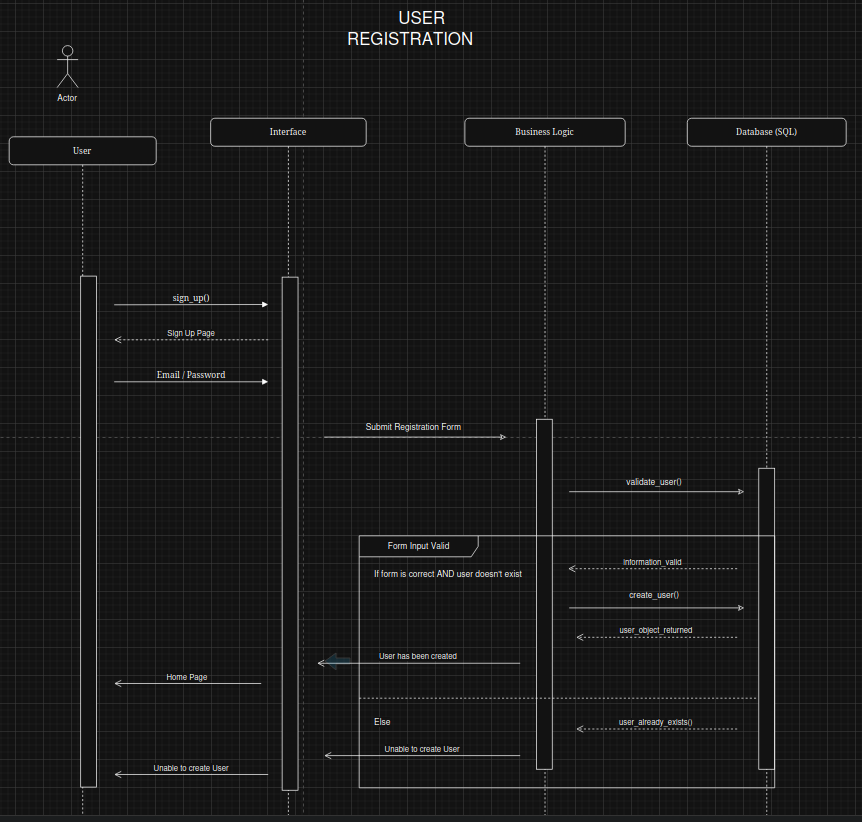
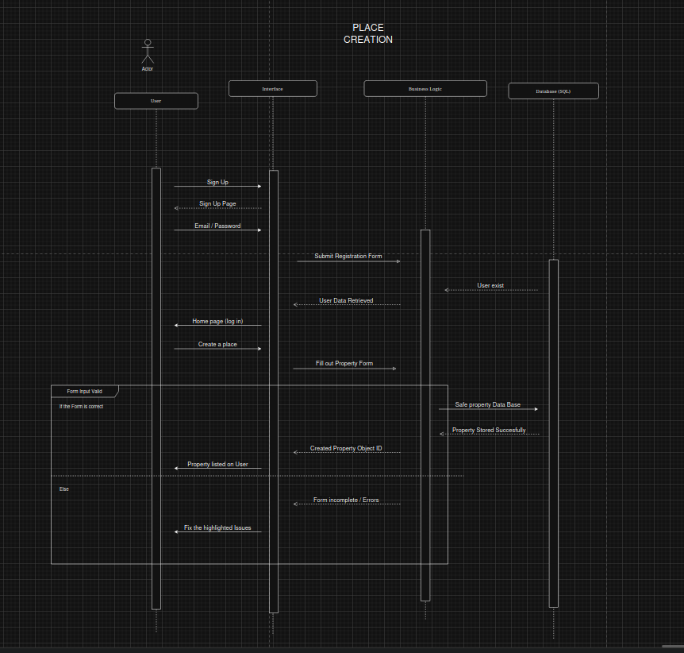
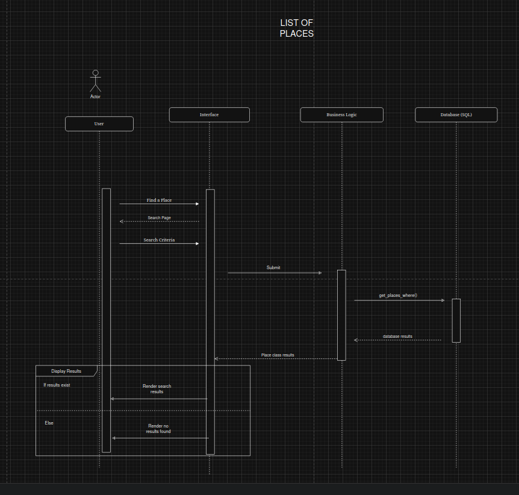

# HBnB Evolution Technical Documentation

## Table of Contents
1. [Introduction](#introduction)
2. [High-Level Architecture](#high-level-diagram)
3. [Business Logic Layer](#class-diagram)
4. [API Interaction Flow](#sequence-diagram)

## Introduction
This technical documentation provides a comprehensive blueprint for the HBnB Evolution application, a simplified version of an AirBnB-like platform. The doucmentation outlines the systems architecture, detailed design of the business logic, and interavtions between different components. 

### Project Scope
The HBnB Evolution application supports:
- User registration and profile management
- Property Listing and management
- Review systems for properties
- Amenity management for properties

## High-Level Diagram
### Package Diagram
```mermaid```

### Layer Responbilities
##### Presentation Layer
- 
##### Business Logic Layer
- 
##### Persistence Layer
- 

---

## Business Logic Layer
### Class Diagram
```mermaid```

### Logic Explanation

---

## Sequence Diagram
### User Registration

The User Registration sequence will allow a new ```User``` to register an account.

The sequence will validate the ```User``` against the ```Database``` to ensure a matching ```user``` doesn't already exists as well as validating the ```User``` data (Username, Password, Email).

If the ```User``` is valid it will be saved to the ```Database``` and the ```Presentation Layer``` will redirect the new ```User``` to their homepage.

If the User is invalid or already exists the ```Presentation Layer``` will display an error prompting the ```User``` to fix the invalid data.



### Place Creation

The Place Creation sequence will allow an existing ```User``` to register a new ```Place```.

The sequence will validate the ```Place``` against the ```Database``` to ensure a matching ```Place``` doesn't already exist as well as validating the ```Place``` data (Address).

If the ```Place``` is successfully created the ```Presentation Layer``` will redirect the ```User``` to their ```Places``` page and they will see their new ```Place``` added to the list.

If the ```Place``` is invalid the ```Presentation Layer``` will display errors prompting the ```User``` to fix the invalid data.



### Review Submission

The Review Submission sequence will allow an existing ```User``` to leave a ```Review``` on a ```Place```.

The sequence will validate the ```Review``` against the ```Database``` to ensure that the ```User``` stayed at the ```Place``` and that the ```Review``` doesn't contain any disallowed words.

If the ```Review``` is successfully created, the ```Presentation Layer``` will redirect the ```User``` to the ```Place``` and they will see their ```Review``` on the ```Place```.

If the ```Review``` is invalid the ```Presentation Layer``` will display errors prompting the ```User``` to fix the ```Review```


### Place Search

The Place Search sequence will allow anyone to search for a ```Place``` with certain criteria.

The ```Business Layer``` will query the ```Database``` with the requested criteria and find a list of ```Places``` that match.

If the ```Database``` returns a list of properties the ```Presentation Layer``` will display them to the visitor.

If the ```Database``` returns an empty list the ```Presentation Layer``` will display a "No Places Found" page.


