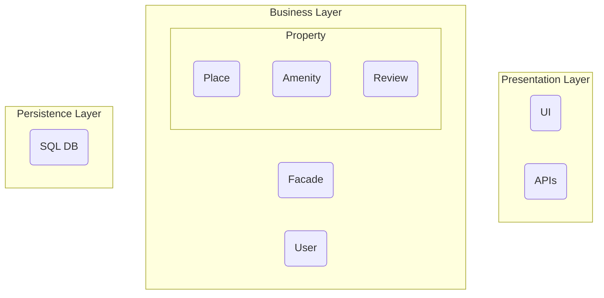

# HBnB Evolution Technical Documentation

## Table of Contents
1. [Introduction](#introduction)
2. [High-Level Package Diagram](#high-level-diagram)
3. [Business Logic Layer](#class-diagram)
4. [API Interaction Flow](#sequence-diagram)

## Introduction
This technical documentation provides a comprehensive blueprint for the HBnB Evolution application, a simplified version of an AirBnB-like platform. The documentation outlines the systems architecture, detailed design of the business logic, and interactions between different components. 

### Project Scope
The HBnB Evolution application supports:
- User registration and profile management
- Property Listing and management
- Review systems for properties
- Amenity management for properties

## High-Level Diagram
### Package Diagram: 
This diagram illustrates the three-layer architecture of the HBnB application. 



It is meant to depict a conceptual overview of how the elements of the HBnB system are organized and how they interact with each other.


### Layer Responbilities
##### Presentation Layer
- 
##### Business Logic Layer
- 
##### Persistence Layer
- 

---

## Business Logic Layer
### Class Diagram
```mermaid```

### Logic Explanation

---

## Sequence Diagram
### User Registration
### Place Creation
### Review Submission
### Place Search

