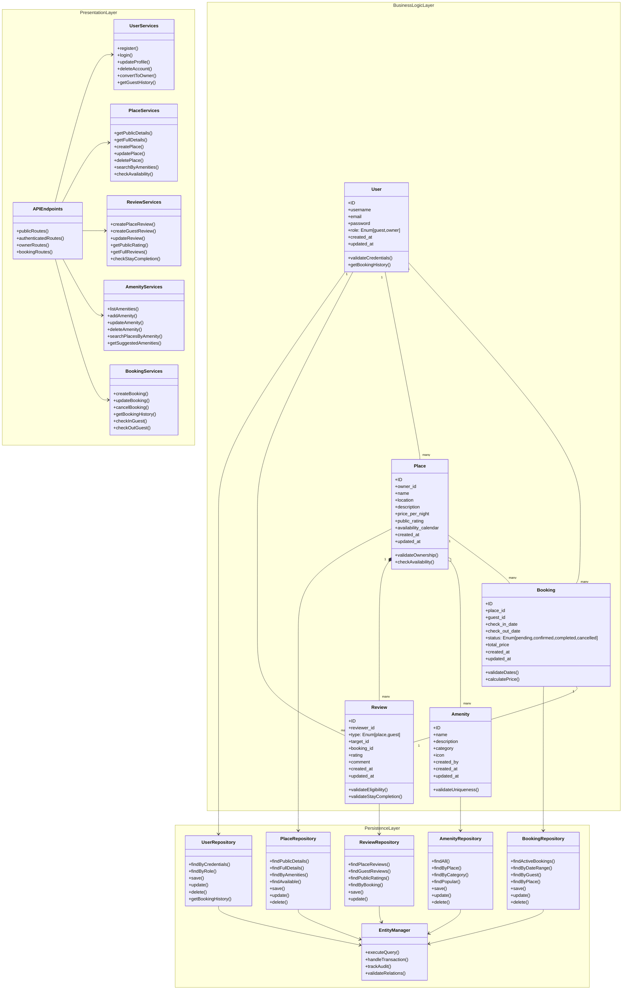

# Okky's `HBnB - UML` Playgound

# *==> Rules: <==*
**--> Each `object` should be uniquely idetified by a `ID` <--** \
**--> `Creation` and `update` *<ins>datetime<ins>* should be registerd for all `entities` <--**

### 1. *`user_entity`*

- [x] (`first_name`)
- [x] (`last_name`)
- [x] (`email`)
- [x] (`password`)
- [x] (`admin`) == boolean (attribute required)
    - able to register (create)
    - edit user_entity
    - delete user_entity

### 2. *`place_entity`*

- [x] (`title`)
- [x] (`description`)
- [x] (`price`)
- [ ] (`latitude`)
- [ ] (`longitude`)
- [x] (`owner`)
    - *link this via ID?*
- [x] (`amenities`)
    - bathroom
    - cinema
    - toilet
    - sauna
    - pool
    - etc
- [ ] (`edit`)
    - ~~create~~
    - ~~update~~
    - ~~delete~~
    - ~~list (post/advertise)~~
### 3. *`review_entity`*
- [x] (`review_place`)
    - [x] `user` able to leave review on listing / property
    - ~~create~~
    - ~~update~~
    - ~~delete~~
    - ~~list by place~~
        - sort function?
- [x] (`rating`)
- [x] (`comment` / `description`)

### 4. *`amenity_entity`*
- [x] (`name`)
- [x] (`description`)
- ~~create~~
- ~~updated~~
- ~~deleted~~
- ~~listed~~

### 5. *`Global / Classes`*
- [ ] `create`
- [ ] `udpate`
- [ ] `delete`
- [ ] `list`

---
---

## ==> HL_PCK_Diagram.io <== 
- Presentation Layer
    - Booking Management
    - Handles user interaction (desktop/mobile)
    - Display properties listings (gallery)

- Facade Pattern
    - Simplify communication to each layer
    - reduce complexity 
    - promote encapsulation (OOP)

- Business Logic Layer
    - Core Application logic
    - User Management
    - Property listing operations/management
    - booking transactions
    - Review management

- Persistence Layer
    - Database Repositories (SQL)
    - Database management
        - users
        - listings

## ==> Class Diagram <==

## Sequence Diagram
### Stories
**userStories**
- [x] As a `user` i want to create an account
    - Click the button `sign-up`
    - New page requesting details of `user`
    - User will fill out form and click `register` to complete
    - New page to confirm email address
    - Once `approved` `user` will be returned back to home page. 

- [ ] As a `owner`(`user`) i want to create a `place`
    - Click `create_place` button
    - Fill out `place_form`
    - Click submit then `place` will be `listed`
     
- [ ] As a `user` i want to submit a `review`
    - Click `submit_review` button after stay date
    - Fill out `review_form` including `rating`
    - Click submit
    - redirected to `place_list` to see their `review`

- [x] As a `user` i want to search for a `place`
    - Click `search_field`
    - Fill in search requirements
    - Click search
    - `place_list` will showcase in "gallery" or on page

- As a `user` i want to delete my `place`
- As a `user` i want to create a `booking`
- As a `user` i want to delete my `account`
- As a `user` i want to update my `details`