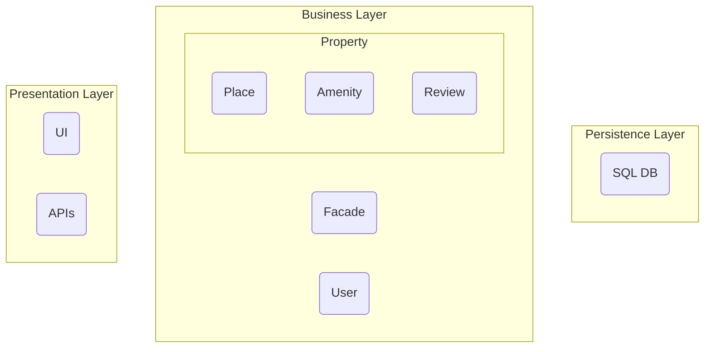
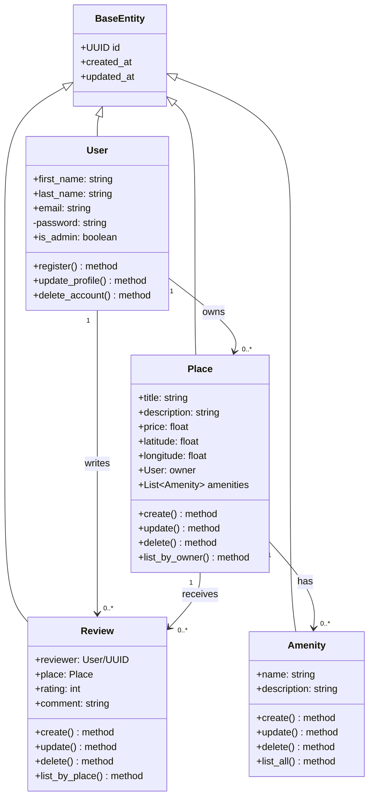

# HBnB Evolution Technical Documentation

## Table of Contents
1. [Introduction](#introduction)
2. [High-Level Package Diagram](#high-level-diagram)
3. [Business Logic Layer](#class-diagram)
4. [API Interaction Flow](#sequence-diagram)

## Introduction
This technical documentation provides a comprehensive blueprint for the HBnB Evolution application, a simplified version of an AirBnB-like platform. The documentation outlines the systems architecture, detailed design of the business logic, and interactions between different components. 

### Project Scope
The HBnB Evolution application supports:
- User registration and profile management
- Property Listing and management
- Review systems for properties
- Amenity management for properties

## High-Level Diagram
### Package Diagram: 
This diagram illustrates the three-layer architecture of the HBnB application. 



It is meant to depict a conceptual overview of how the elements of the HBnB system are organized and how they interact with each other.

Follow this *[link](https://app.diagrams.net/#HJacobsDevs%2FHBnB_evolution%2Fokky%2FHBnB%20Evolution%20-%20Package%20Diagram.drawio#%7B%22pageId%22%3A%22b5b7bab2-c9e2-2cf4-8b2a-24fd1a2a6d21%22%7D)* for a more detailed view:

### Layer Responsibilities
##### Presentation Layer

1. Provides user interaction via a UI (User Interface).

2. Exposes system functionalities through APIs.

3. Handles client requests and formats responses accordingly.

##### Business Logic Layer

1. Manages core application logic and data processing.

2. Contains the Facade component, which acts as an interface for various business operations.
 4 conflicts 
3. Handles Users, Properties (Places, Amenities, Reviews), and their interaction with each other.

4. Ensures security, validation, and enforcement of business rules.


##### Persistence Layer

1. Stores and manages data using a SQL Database.

2. Ensures data consistency and integrity.

3. Provides CRUD (Create, Read, Update, Delete) operations for the business layer.

---

## Business Logic Layer
### Class Diagram


### Logic Explanation

<details><summary><u>BaseEntity Class</u></summary>
<br>

*This is the abstract base class that provides common attributes for all entities in the system.*

#### Attributes:
- `id` (UUID): Unique identifier for each entity instance
- `created_at` (DateTime): Timestamp when the entity was created
- `updated_at` (DateTime): Timestamp when the entity was last updated

#### Purpose:
- Provides audit trail capabilities
- Ensures consistent identification across all entities
- Implements common functionality for entity tracking
</details>

<details><summary><u>User Class</u></summary>
<br>

*Represents a user in the system, extending BaseEntity.*

#### Attributes:
- `first_name` (String): User's first name
- `last_name` (String): User's last name
- `email` (String): User's email address (unique)
- `password` (String): Hashed password
- `is_admin` (Boolean): Flag indicating administrative privileges

#### Methods:
- `register()`: Creates a new user account
- `update_profile()`: Updates user information
- `delete_account()`: Removes user account from system

#### Relationships:
- **One-to-Many** with Place (as owner)
- **One-to-Many** with Review (as reviewer)
</details>

<details><summary><u>Place Class</u></summary>
<br>

*Represents a property listing in the system, extending BaseEntity.*

#### Attributes:
- `title` (String): Name/title of the property
- `description` (String): Detailed description
- `price` (Float): Daily rental price
- `latitude` (Float): Geographic latitude
- `longitude` (Float): Geographic longitude
- `owner` (User): Reference to the property owner
- `amenities` (List<Amenity>): Associated amenities

#### Methods:
- `create()`: Lists a new property
- `update()`: Modifies property details
- `delete()`: Removes property listing
- `list_by_owner()`: Retrieves all properties for a specific owner

#### Relationships:
- **Many-to-One** with User (as owner)
- **One-to-Many** with Review (as reviewed place)
- **Many-to-Many** with Amenity
</details>

<details><summary><u>Review Class</u></summary>
<br>

*Represents a user review for a property, extending BaseEntity.*

#### Attributes:
- `reviewer` (User): Reference to the user writing the review
- `place` (Place): Reference to the reviewed property
- `rating` (Integer): Numerical rating (typically 1-5)
- `comment` (String): Textual review content

#### Methods:
- `create()`: Submits a new review
- `update()`: Modifies review content
- `delete()`: Removes a review
- `list_by_place()`: Retrieves all reviews for a specific property

#### Relationships:
- **Many-to-One** with User (as reviewer)
- **Many-to-One** with Place (as reviewed property)
</details>

<details><summary><u>Amenity Class</u></summary>
<br>

*Represents a property amenity, extending BaseEntity.*

#### Attributes:
- `name` (String): Name of the amenity
- `description` (String): Detailed description of the amenity

#### Methods:
- `create()`: Adds a new amenity type
- `update()`: Modifies amenity details
- `delete()`: Removes an amenity type
- `list_all()`: Retrieves all available amenities

#### Relationships:
- **Many-to-Many** with Place
</details>

<details><summary><u>Relationship Details</u></summary>

### User --> Place Relationship
- A user can own multiple places
- Each place must have exactly one owner

### User --> Review Relationship
- A user can write multiple reviews
- Each review must have exactly one reviewer

### Place --> Review Relationship
- A place can have multiple reviews
- Each review must be associated with exactly one place

### Place --> Amenity Relationship
- A place can have multiple amenities
- An amenity can be associated with multiple places
</details>

<details><summary><u>Data Validation Rules</u></summary>

### User Entity
- Email must be unique and follow email format
- Password must meet minimum security requirements
- First name and last name cannot be empty

### Place Entity
- Price must be positive
- Title and description cannot be empty
- Must have at list one Amenity attached

### Review Entity
- Rating must be between 1 and 5
- Comment cannot be empty
- User cannot review their own property
- User can only review property they booked

### Amenity Entity
- Name must be unique
- Description cannot be empty
</details>

---

## Sequence Diagram
### User Registration

The User Registration sequence will allow a new ```User``` to register an account.

The sequence will validate the ```User``` against the ```Database``` to ensure a matching ```user``` doesn't already exists as well as validating the ```User``` data (Username, Password, Email).

If the ```User``` is valid it will be saved to the ```Database``` and the ```Presentation Layer``` will redirect the new ```User``` to their homepage.

If the User is invalid or already exists the ```Presentation Layer``` will display an error prompting the ```User``` to fix the invalid data.


### Place Creation

The Place Creation sequence will allow an existing ```User``` to register a new ```Place```.

The sequence will validate the ```Place``` against the ```Database``` to ensure a matching ```Place``` doesn't already exist as well as validating the ```Place``` data (Address).

If the ```Place``` is successfully created the ```Presentation Layer``` will redirect the ```User``` to their ```Places``` page and they will see their new ```Place``` added to the list.

If the ```Place``` is invalid the ```Presentation Layer``` will display errors prompting the ```User``` to fix the invalid data.


### Review Submission

The Review Submission sequence will allow an existing ```User``` to leave a ```Review``` on a ```Place```.

The sequence will validate the ```Review``` against the ```Database``` to ensure that the ```User``` stayed at the ```Place``` and that the ```Review``` doesn't contain any disallowed words.

If the ```Review``` is successfully created, the ```Presentation Layer``` will redirect the ```User``` to the ```Place``` and they will see their ```Review``` on the ```Place```.

If the ```Review``` is invalid the ```Presentation Layer``` will display errors prompting the ```User``` to fix the ```Review```


### Place Search

The Place Search sequence will allow anyone to search for a ```Place``` with certain criteria.

The ```Business Layer``` will query the ```Database``` with the requested criteria and find a list of ```Places``` that match.

If the ```Database``` returns a list of properties the ```Presentation Layer``` will display them to the visitor.

If the ```Database``` returns an empty list the ```Presentation Layer``` will display a "No Places Found" page.


