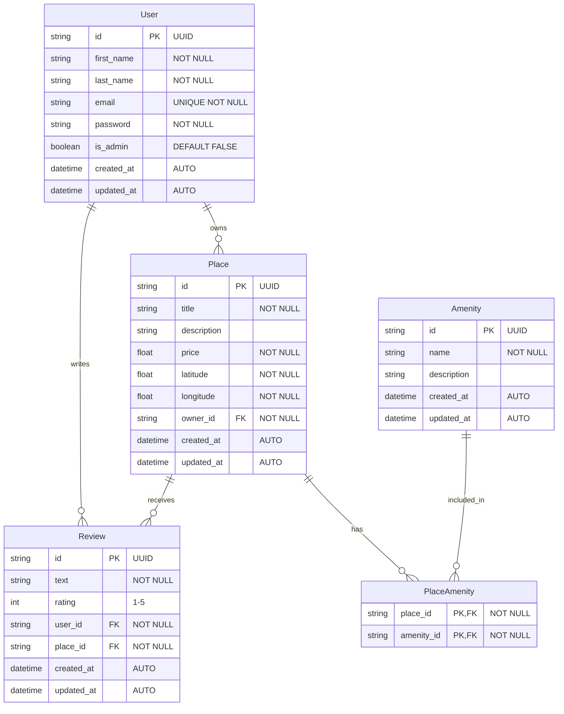
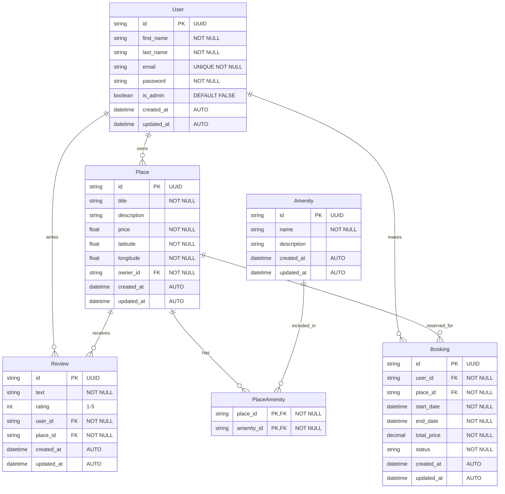

# HBnB Database Entity-Relationship Diagram

This document explains the database schema for the HBnB project using Entity-Relationship diagrams created with Mermaid.js.

## Database Schema Overview

The HBnB platform's database consists of these main entities:

- **User**: Represents users of the platform, including regular users and administrators
- **Place**: Represents accommodations/listings that users can book
- **Review**: Represents reviews left by users for places they've visited
- **Amenity**: Represents features or services available at a place (e.g., WiFi, Pool)
- **PlaceAmenity**: A junction table representing the many-to-many relationship between Places and Amenities

## Entity-Relationship Diagram

The following ER diagram visualizes the tables and their relationships:

## Relationships Explained

### One-to-Many Relationships

1. **User-Place**: A user can own multiple places, but each place has exactly one owner.
   - Implemented via `owner_id` foreign key in the `Place` table.

2. **User-Review**: A user can write multiple reviews, but each review is written by exactly one user.
   - Implemented via `user_id` foreign key in the `Review` table.

3. **Place-Review**: A place can receive multiple reviews, but each review is for exactly one place.
   - Implemented via `place_id` foreign key in the `Review` table.

### Many-to-Many Relationships

1. **Place-Amenity**: A place can have multiple amenities, and an amenity can be available at multiple places.
   - Implemented using the junction table `PlaceAmenity` with composite primary key of `place_id` and `amenity_id`.

## ER Diagram Notation Explained

- **PK**: Primary Key
- **FK**: Foreign Key
- **NOT NULL**: Column cannot contain NULL values
- **UNIQUE**: Column must contain unique values
- **DEFAULT**: Default value for the column
- **AUTO**: Automatically generated/updated

The relationship symbols used in the diagram:

- `||--o{`: One-to-many relationship (the entity on the left has one, the entity on the right has many)
- `}|--|{`: Many-to-many relationship

## How This Maps to SQLAlchemy Models

This ER diagram directly corresponds to the SQLAlchemy models in our application:

- The `User`, `Place`, `Review`, and `Amenity` classes each represent a table
- The many-to-many relationship between `Place` and `Amenity` is implemented using the `place_amenity` association table
- SQLAlchemy relationships with `backref` create bidirectional links between tables 

    - The `backref='owner'` parameter does something special - it automatically creates a reverse relationship. This means:

        - You can access a user's places with `user.places` (giving you all places owned by that user)
        - You can also access a place's owner with `place.owner` (giving you the user who owns that place)

    - This is what's meant by "bidirectional links" - you can navigate the relationship in both directions:

        - From parent to children (User → Places)
        - From child back to parent (Place → User)

## Extended Diagram with Future Entities

Below is an extended version of the ER diagram that includes potential future entities such as `Booking`:

